# OpusHeart — Feature Overview

> A modern, self-hosted community management platform built for churches, nonprofits, and faith-based organizations.

## Dashboard

At-a-glance overview of your community with live stats for members, upcoming events, active groups, and sermon library.

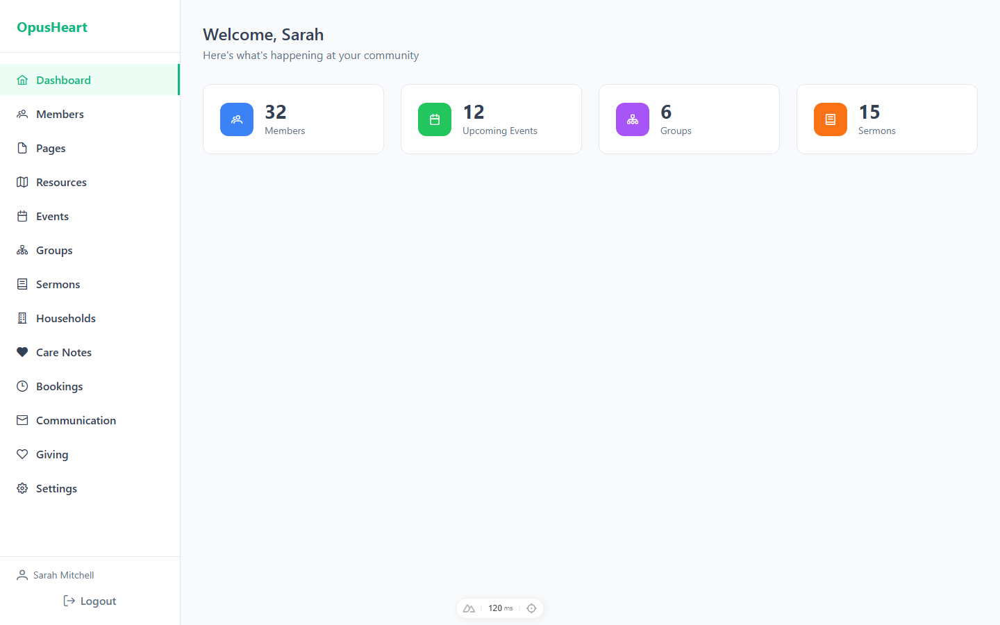

## Member Management

Full member directory with search, status filtering, and detailed profiles. Track membership status, household assignments, group participation, and attendance opt-in preferences.

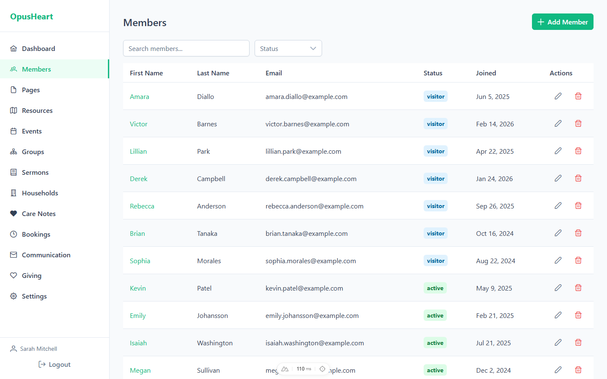

## Events

Create and manage events with recurring schedules, volunteer slot coordination, RSVP tracking, and visibility controls (public, members-only, leaders-only). Supports registration caps and resource bookings.

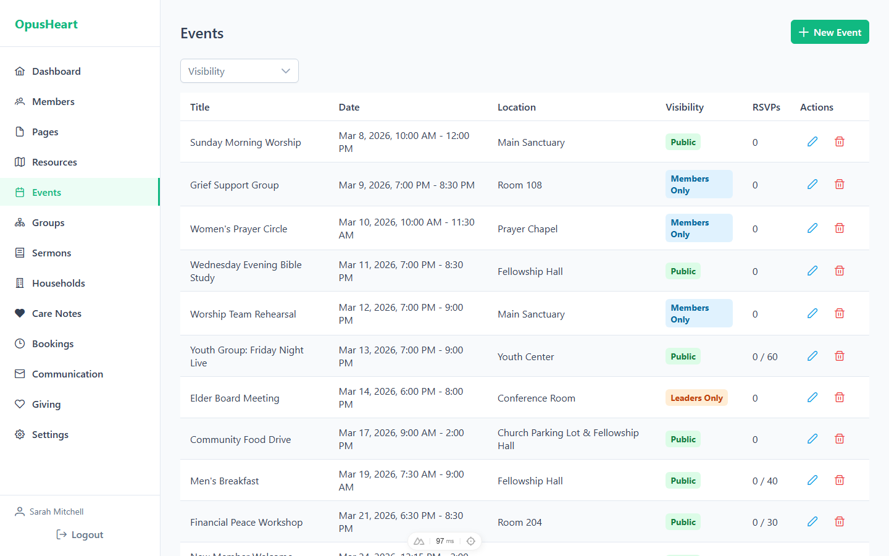

## Groups

Organize your community into small groups, Bible studies, committees, ministry teams, and classes. Track membership, meeting schedules, and shared materials.

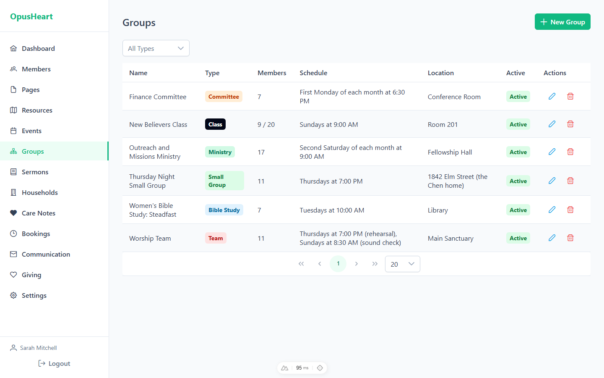

## Sermons

Manage your sermon library with series organization, scripture references, speaker tracking, and podcast integration. Supports draft/published workflow for upcoming messages.

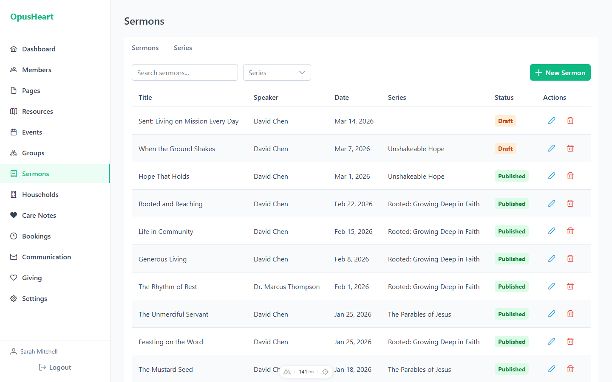

## Communication

Send messages to your community via email, web-push notifications, or in-app announcements. Target specific audiences by group, role, or custom member lists. Schedule messages for future delivery. *(SMS is planned as a bring-your-own-provider feature and is not yet wired.)*

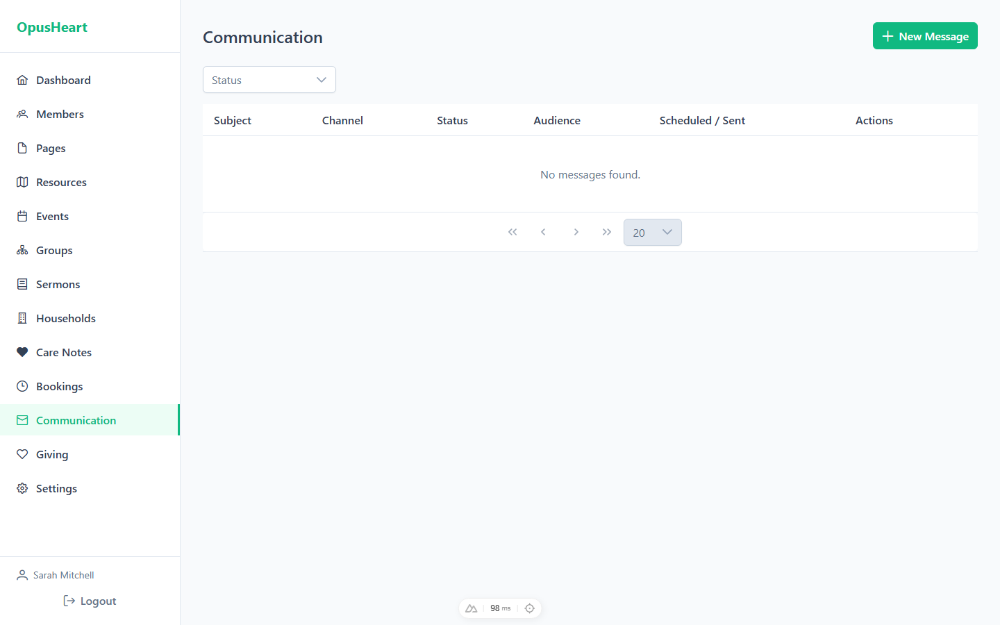

## Giving

Manage funds with goal tracking and record donations (online, cash, check). Generate annual giving statements for tax purposes. Support recurring donation schedules.

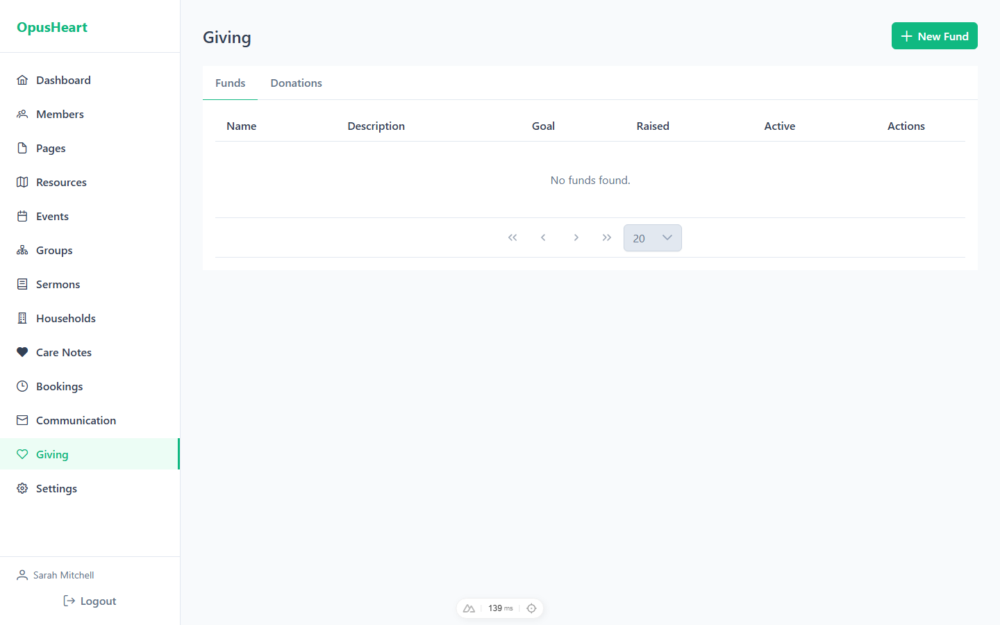

## Website Pages

Build and manage your public-facing website pages with a page builder. SEO controls, publish/draft/archive workflow, slug management, and page duplication.

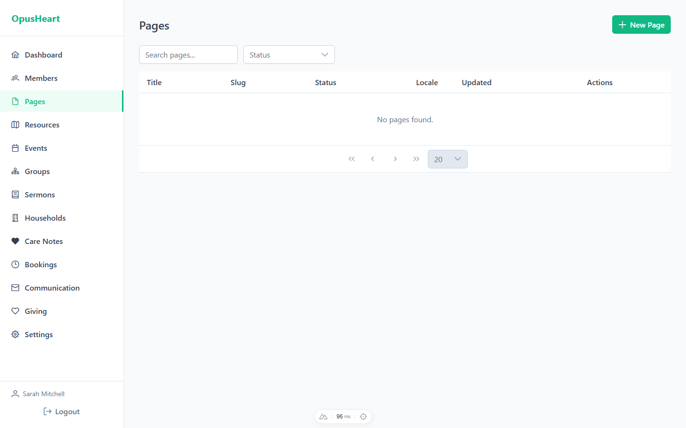

## Community Resource Hub

Curate a directory of community resources (food, housing, medical, employment, etc.) with public submission and moderation workflows. Geo-location support for nearby resource discovery.

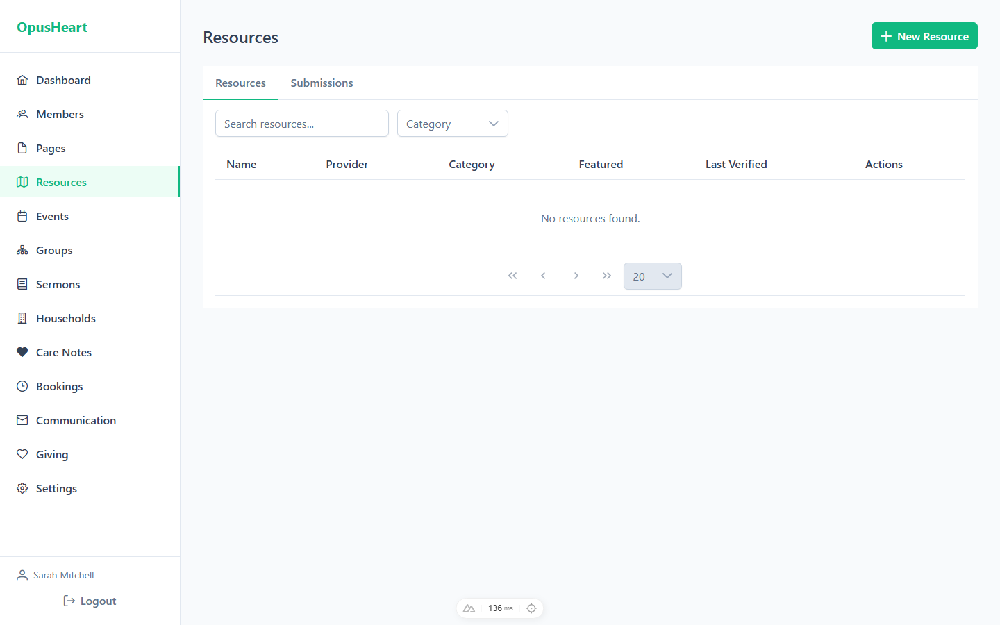

## Households

Group members into households for family-based communication and care tracking. Manage household addresses and member associations.

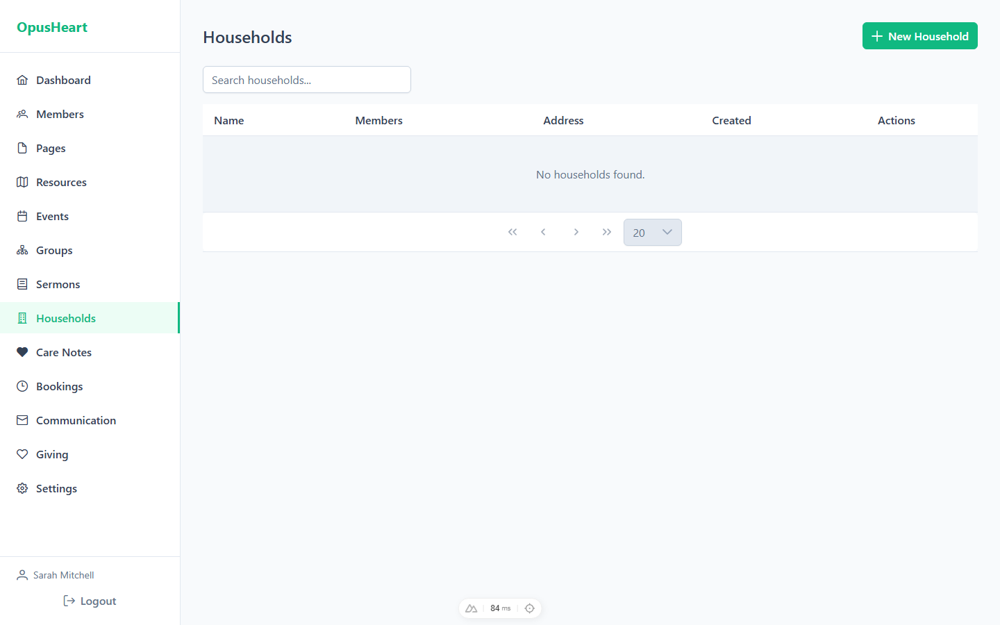

## Member Care

Confidential care notes for pastoral staff to track visits, hospital calls, bereavement support, meal trains, and follow-ups. All care note content is encrypted at rest.

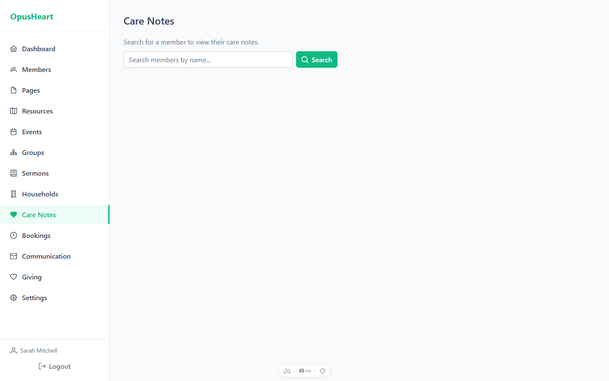

## Bookings

Reserve rooms, vehicles, equipment, and other resources for events and ministry activities. Built-in conflict detection prevents double-bookings.

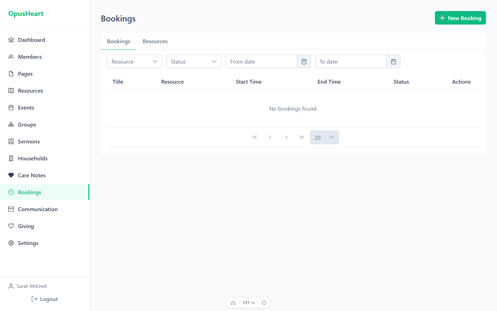

## Settings

Customize your instance with theme colors, fonts, logos, and custom CSS. Admin-only access for platform configuration.

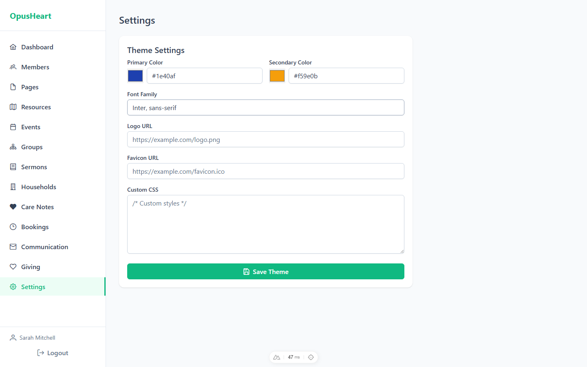

---

## Technical Highlights

- **Self-hosted** — Your data stays on your infrastructure
- **Privacy-first** — Encrypted fields for sensitive data (addresses, care notes, donation details)
- **Feature toggles** — Enable only what your community needs
- **Federation-ready** — Connect with other OpusHeart instances via the Connect protocol
- **AI-powered** — Optional AI summaries for sermons and resources
- **PWA-ready** — Installable app with web-push notifications; public content (resources, events, sermons) is cached for poor connections
- **Multi-language** — i18n-ready with locale support on pages and user profiles
- **Docker-native** — Production-ready Dockerfiles and Swarm stack included
